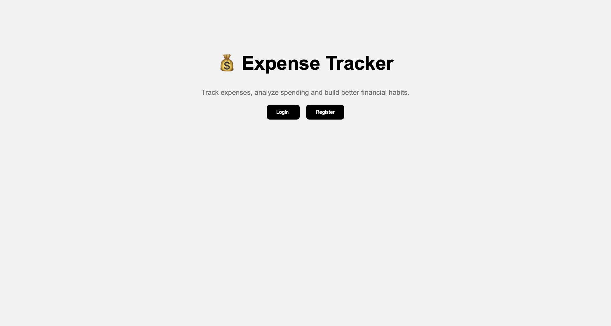
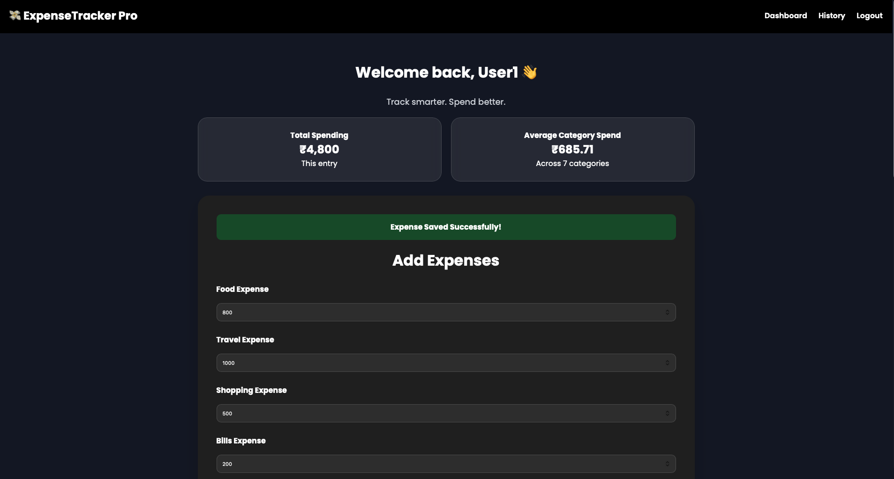
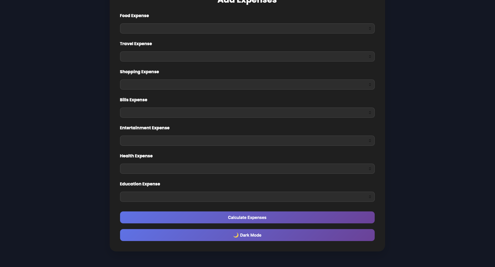
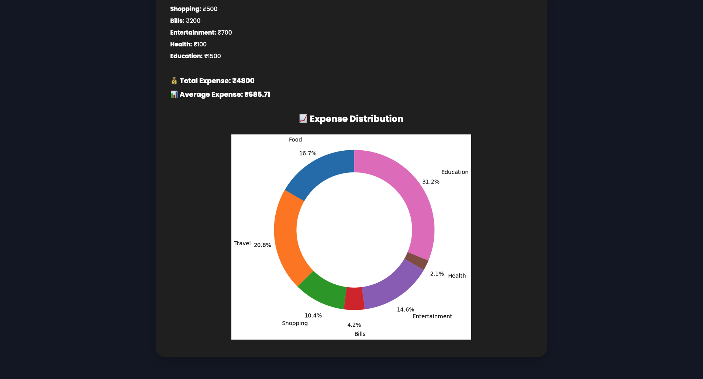

# Expense Tracker Pro

A Flask-based web application for tracking expenses, analyzing spending habits, and visualizing expense distribution through interactive charts.

## Features

- User Registration and Login
- Expense Management
- Expense History Tracking
- Total Expense Calculation
- Average Expense Analysis
- Expense Distribution Chart
- Dark Mode Interface
- Responsive Design

## Technology Stack

- Python
- Flask
- HTML
- CSS
- Jinja2
- Matplotlib

## Screenshots

### Landing Page



### Login Page


### Dashboard



### Expense Entry Form



### Expense Analytics



## Demo Video

https://drive.google.com/file/d/1272G1wA4FeBl1BIKD3yIRb8Da_MT5ZpQ/view?usp=drive_link

## Project Structure

```text
Expense-Tracker/
│
├── templates/
│   ├── landing.html
│   ├── login.html
│   ├── register.html
│   ├── index.html
│   └── history.html
│
├── static/
├── app.py
├── requirements.txt
├── README.md
└── .gitignore
```

## Installation

Clone the repository:

```bash
git clone https://github.com/thakurtrishit2005-art/Expense-Tracker.git
```

Move to the project directory:

```bash
cd Expense-Tracker
```

Install dependencies:

```bash
pip install -r requirements.txt
```

Run the application:

```bash
python app.py
```
